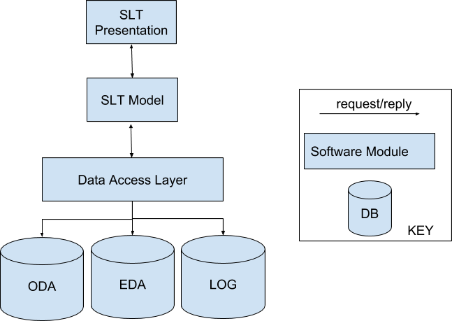

.. _introduction:

Introduction
=============
For the SKA the intent of the Shift Log Tool is to "harvest" key event information from the main telescope databases, 
using one "shift log" for each telescope. 
At the telescope sites the SLT will collect and filter information on all the events taking place during an operational “shift”. 
This includes informational records and information on failures, warnings and events such as unexpected RFI detection.

The Shift Log Tool (SLT) is envisioned as both an “on-line” tool, used in real-time by the operators at the two telescope sites, and as an “off-line” tool, used at any of the three SKA sites. Its intention is to collate and then provide access to a record of the major events occurring during an operator’s shift.

* At the telescope sites, the SLT will:

   * Collect and filter information on all events occurring during an operational shift.
   * Gather information from the EDA(Engineering Data Archive), ODA(OSO Data Archive), and Log DB.
   * Operate continuously but organize information based on the concept of a "shift" (expected duration: 6-12 hours).
   * Provide a user interface for the telescope operator to view collated information in real-time and recent history.
   * Allow the telescope operator to enter narrative records linked to specific events.

* At the observatory level (not in real-time during a shift), science operations staff at all three sites must be able to:
   
   * Use the SLT to view, interrogate, and annotate information collected during a shift.
   * Annotate the information, but not modify the original data from databases or operator entries.

* The Shift Log information collected by the SLT must be persisted for the lifetime of the SKA Observatory.

.. note::
    * The current version of the SLT (Shift Log Tool) service retrieves log data from the ODA system. 
    * Shift data is getting saved into ODA.

.. note::
   * For generating ``shift_id`` SLT is using `SKUID <https://confluence.skatelescope.org/display/SWSI/SKA+Unique+Identifiers>`_ the format is ``sl-m0001-20241212-0001``. 
   * Based on Telescope Type ``shift_id`` is generated for MID and LOW.
   * For Mid ``sl-m0001-20241212-0001`` and for Low ``sl-l0001-20241212-0001``.

Architecture Diagram

